# Hệ Thống Bài Tập & Đồ Án Trí Tuệ Nhân Tạo (AI)

Kho lưu trữ này chứa toàn bộ các bài tập thực hành theo tuần (Buổi 1 - 13) và chuỗi dự án phát triển hệ thống tác tử thông minh (Vacuum Cleaner AI Agent) kết hợp giải thuật tìm kiếm nâng cao từ cơ bản đến báo cáo cuối kỳ (project_final.py).

## 📁 Cấu Trúc Kho Lưu Trữ

### --- Chuỗi Dự Án & Đồ Án Phát Triển Tác Tử ---

* **├── README.md** # Tài liệu hướng dẫn này
* **├── project.py** # Phiên bản sơ khai ban đầu
* **├── project_1.py** # Xây dựng cấu trúc Node và không gian trạng thái
* **├── project_2.py** # Tích hợp thuật toán tìm kiếm mù (BFS, DFS)
* **├── project_3.py** # Thử nghiệm giới hạn độ sâu (DLS) và UCS
* **├── project_4.py** # Áp dụng Heuristic (Greedy, A*, IDA*)
* **├── project_5.py** # Tối ưu hóa cục bộ (Hill Climbing, Simulated Annealing, Beam Search)
* **├── project_6.py** # Môi trường phức tạp (Kịch bản ngẫu nhiên No Start/No Goal)
* **├── project_7.py** # Tích hợp CSP Bản đồ VN
* **├── project_final.py** # ĐỒ ÁN TỔNG HỢP: Tác tử hút bụi + CSP Bản đồ VN + AI Đối kháng Caro

### --- Quản Lý Tác Tử Học Phần ---

* **├── mayhutbui.py** # Tác tử phản xạ đơn giản (Simple Reflex Agent)
* **├── mayhutbuiModelBased.py** # Tác tử dựa trên mô hình (Model-Based Agent)
* **├── mayhutbuinangcao.py** # Tác tử nâng cao tích hợp luật suy diễn

### --- Các File Thuật Toán Bổ Trợ Theo Mô-đun ---

* **├── solve8.py** # Mô-đun giải thuật tìm kiếm mẫu 8-puzzle A
* **├── solve8A.py** # Mô-đun giải thuật tìm kiếm mẫu 8-puzzle B
* **├── solve8BFS.py** # Mô-đun chuyên biệt cho Breadth-First Search
* **├── solve8GD.py** # Mô-đun chuyên biệt cho Greedy Search / Heuristic
* **├── solve8nagcao.py** # Giải thuật nâng cao cải tiến hiệu suất duyệt nút
* **└── solve8noStart.py** # Xử lý kịch bản khuyết thông tin trạng thái đầu

---

## 🛠️ Chi Tiết Các Thuật Toán Được Tích Hợp

### 1. Thuật toán tìm kiếm mù thông tin

Thuật toán BFS cách 1
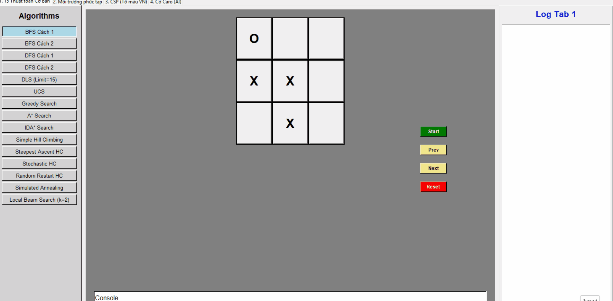

Thuật toán BFS cách 2
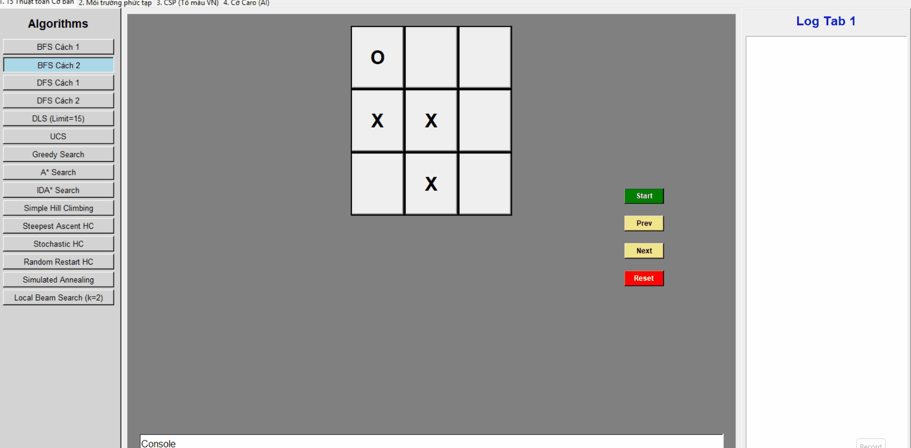

Thuật toán DFS cách 1
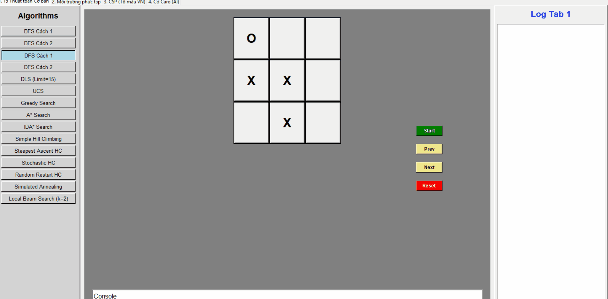

Thuật toán DFS cách 2
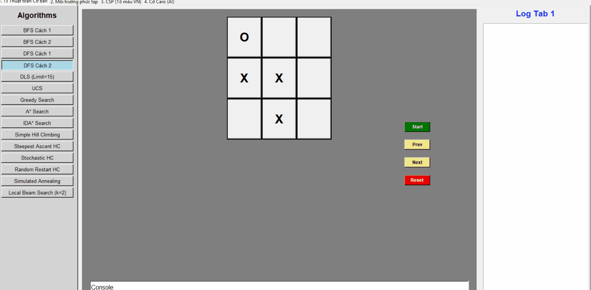

Thuật toán DLS (Limit = 15)
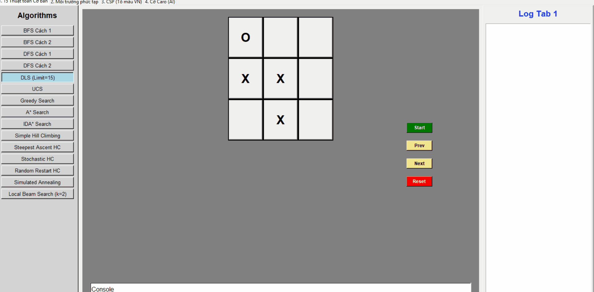

Thuật toán UCS
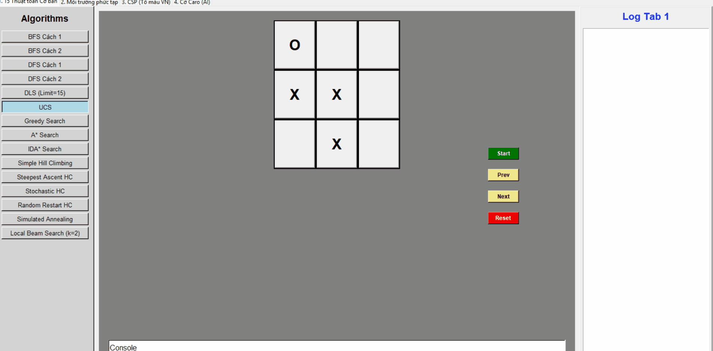

### 2. Thuật toán tìm kiếm có thông tin

Thuật toán Greedy Search
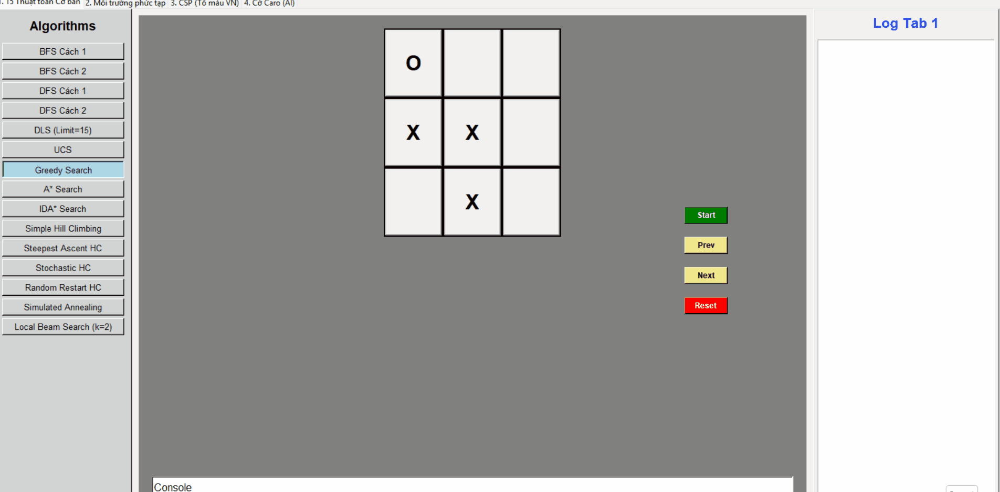

Thuật toán A*
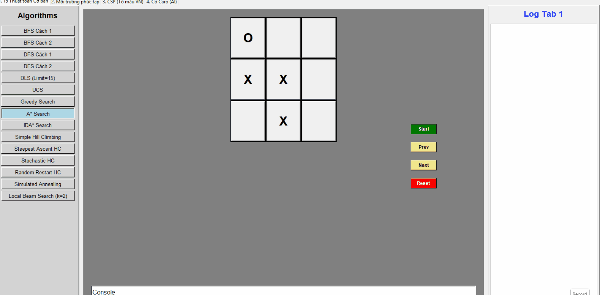

Thuật toán IDA*
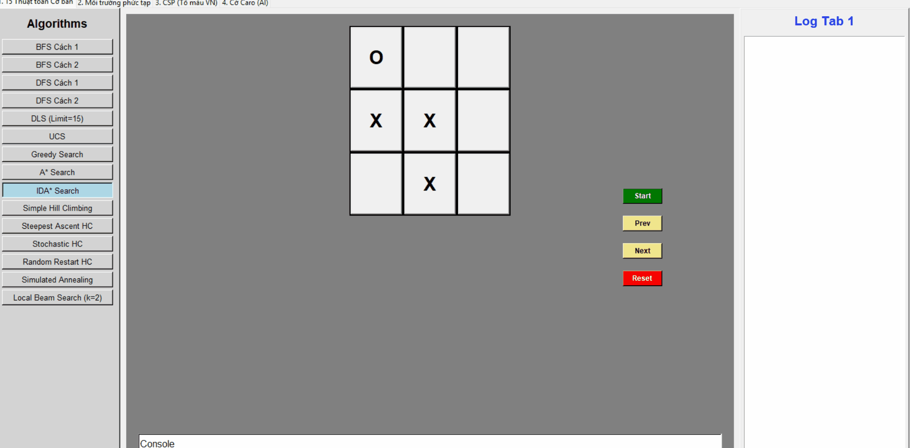

### 3. Thuật toán tìm kiếm cục bộ

Thuật toán Simple Hill Climbing
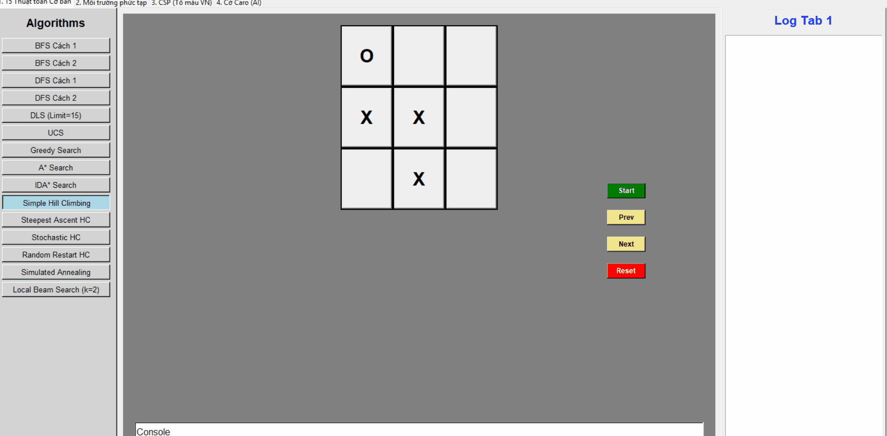

Thuật toán Steepest Hill Climbing


Thuật toán Stochastic Hill Climbing
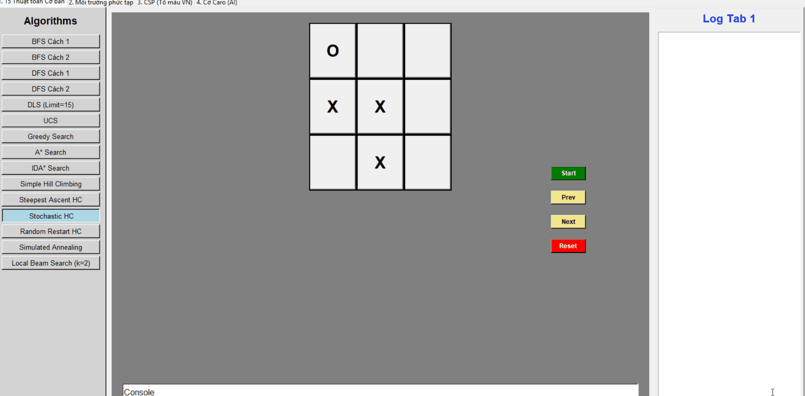

Thuật toán Random Restart Hill Climbing
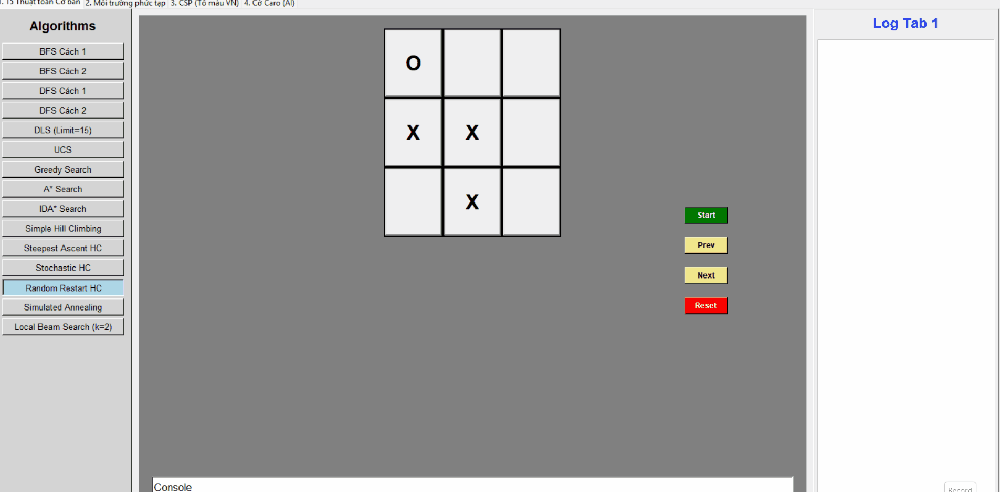

Thuật toán Simulated Annealing
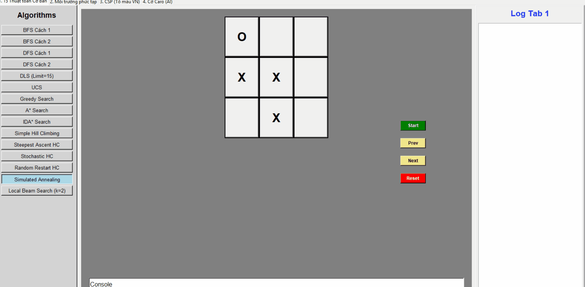

Thuật toán Local Beam Search (k=2)
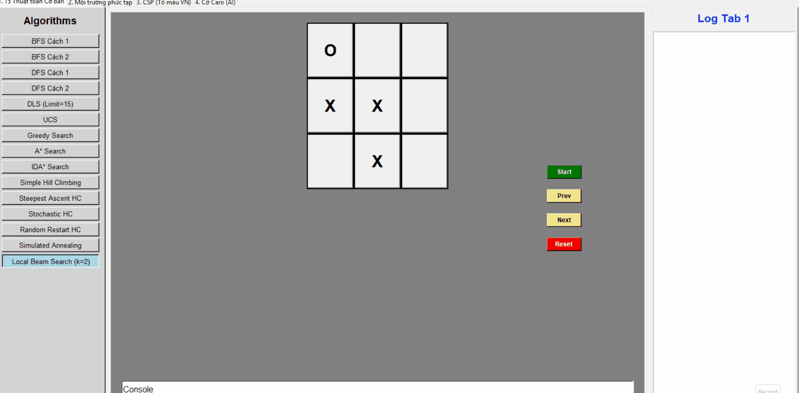

### 4. Thuật toán tìm kiếm trong môi trường phức tạp

Thuật toán No Start
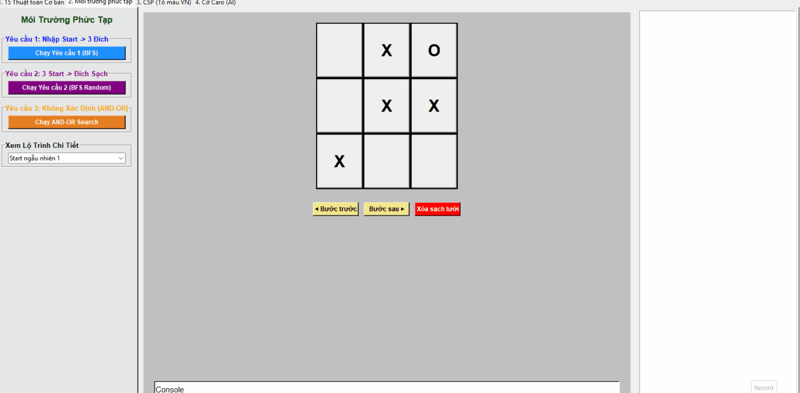

Thuật toán No Goal
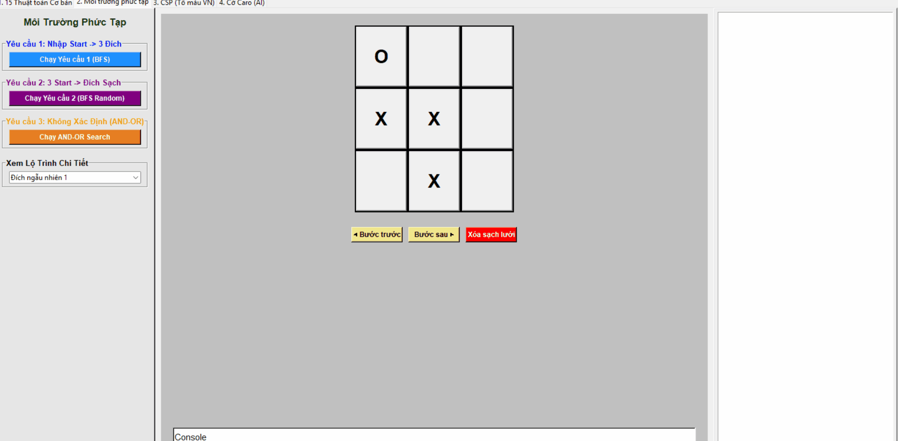

### 5. Thuật toán tìm kiếm thảo mãn ràng buộc

Các thuật toán giải bài toán tô màu bản đồ Việt Nam
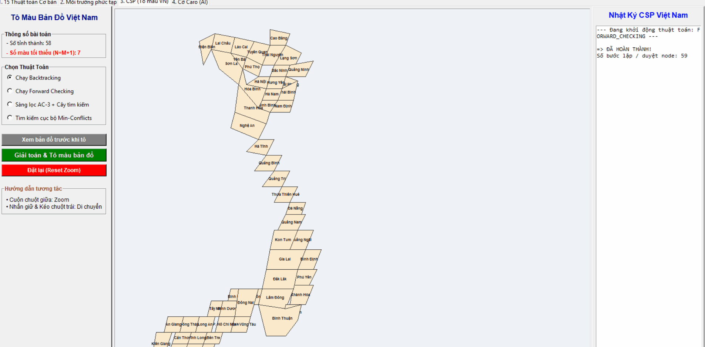

### 6. Thuật toán tìm kiếm đối kháng

Thuật toán Minimax
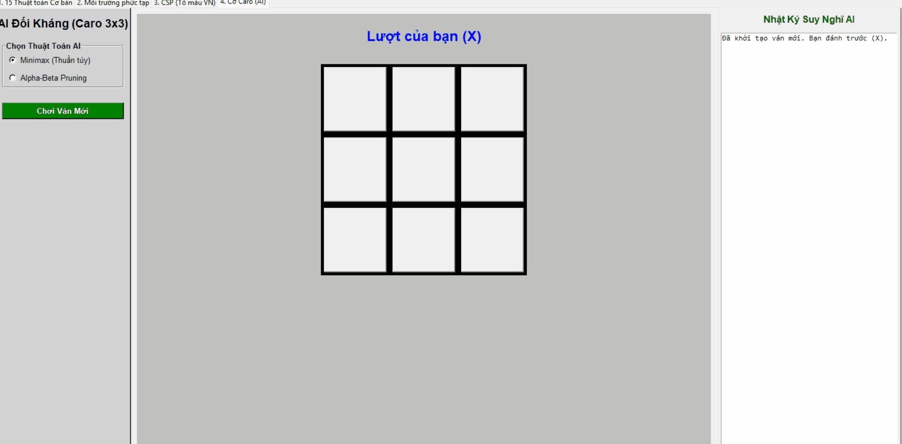

Thuật toán Alpha Beta


---

## 🚀 Hướng Dẫn Chạy Chương Trình

## --- Yêu cầu hệ thống ---

- Python 3.x trở lên.
- Thư viện đồ họa tích hợp sẵn tkinter.
  
## --- Cách vận hành đồ án tổng hợp cuối kỳ ---
Để khởi chạy giao diện tích hợp đầy đủ tất cả các phân hệ và thuật toán lý thuyết, hãy thực hiện lệnh sau trong terminal:
```bash
python project_final.py
```
